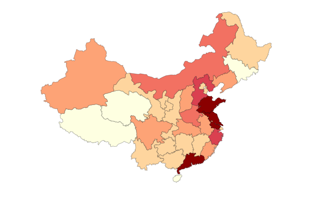
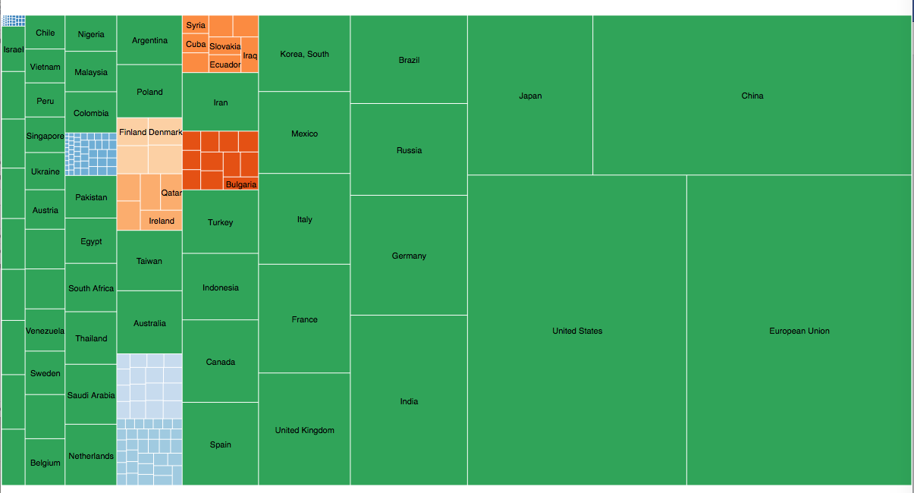

## Welcome to the CES 2018 briefing for the Chinese companies 

This wiki page is dedicated to introduce the Consumer Electronics Show (CES) 2018 in Las vegas. Since 2015, the chinese technology companies start to play an important role on this yearly exhibition and catch the attention of the attendance from all over the world. So this wiki page will help the view have a closer approach to the CES 2018 with a study focus on the chinese companies. It mainly has 3 parts on this web: *the introduction to the key chinese techonlogy companies*, *the geo-distribution of the companies (normal graphe and D3 visalisation)*, and *the analysis of the strong technology trend in china*. 

## Part one : the history-breaking figures and innovations in china 
Chinese technology companies were in the limelight at this year’s Consumer Electronics Show in Las Vegas as more than 1,500 companies put their gadgets and innovations in the spotlight.

With Chinese exhibitors second only to the United States' roughly 1,600 companies at the CES, their new cooperations, products, and technology displays also came to the fore.

According to an earlier report by China Daily, Chinese participants are much more confident and much better at communication than before.Now let's catch some of their glittering moments at the event.

### *BAIDU* : Apollo, self - driving car for future 

Baidu, Inc. (Chinese: 百度), incorporated on 18 January 2000, is a Chinese multinational technology company specializing in Internet-related services and products, and artificial intelligence, headquartered at the Baidu Campus in Beijing's Haidian District. It is one of the largest internet companies.The holding company of the group was incorporated in the Cayman Islands. Baidu was established in 2000 by Robin Li and Eric Xu. Baidu is currently ranked 4th overall in the Alexa Internet Rankings.

In the CES 2018, it is announced that the internet giant Baidu Inc, the Beijing-based answer to Google, will join forces with US-based chipmaker Nvidia Corp and German automotive supplier ZF to create a production-ready AI autonomous vehicle system designed for China.
  

The collaboration is based on the new Nvidia Drive Xavier, ZF’s new ProAI car computer and Baidu’s open autonomous driving platform called Apollo.  The founder and CEO of Nvidia is Jensen Huang. 

At the same time, Baidu Inc also announced its cooperation with Access Services, a US-based public paratransit services provider to launch a self-driving pilot project in Los Angeles by the end of this year, while the company and Singapore technology conglomerate Asia Mobility Industries unveiled a joint venture and a newly established $200 million fund to promote the commercialization of Baidu's autonomous driving technologies in Southeast Asia.

### ALIBABA : Paying with Alipay on your phone abroad, duty free is burden free

Alibaba Group Holding Limited (Chinese: 阿里巴巴集团控股有限公司) is a Chinese multinational e-commerce, retail, Internet, AI and technology conglomerate founded in 1999 that provides consumer-to-consumer, business-to-consumer and business-to-business sales services via web portals, as well as electronic payment services, shopping search engines and cloud computing services. 

It owns and operates a diverse array of businesses around the world in numerous sectors and is named as one of the world's most admired companies by Fortune.

At CES this year, the online retail giant Alibaba set up a major display area and showcased its payment service - Alipay, which helps US and Europe companies to reach many Chinese tourists coming to the abroad each year. With the help the Alipay the Chinese tourists can pay with smartphone by scanning the codes without chaning the currenct no matter which country they travel to. at the same time, the duty free service will automatically turned on and refunded to their associtated bank. This will largely increase the sales in the overseas duty-free shopping stores and attract more and more chinese travellers.This easy one-stand services has big potentials in the future, benifiting both the customers as well as the companies. 

### Huawei  : 5G is just at your sight 

Huawei Technologies Co. Ltd. (Chinese: 华为) is a Chinese multinational networking, telecommunications equipment, and services company headquartered in Shenzhen, Guangdong. It is the largest telecommunications equipment manufacturer in the world, having overtaken Ericsson in 2012.  In 2017, Huawei became 83th of Fortune 500 in Fortune Magazine.

The CEO of Huawei's consumer products division is Richard Yu. He reveal the ambition of the Chinese internet companies in the Ces 2018: China wants to be the leader, not a follower in 5G. 

"We were behind in 3G development, but we caught up with others in 4G and will be the global leader of the ICT (information and communications technology) industry in the era of 5G."

For Huawei, 5G innovations made it into the keynote speech that launched the Mate 10 Pro smartphone, which features the world's fastest "4.5G or pre-5G experience". 5G is the next frontier in mobile networks and wireless communications, and will feature faster data transfer. 

### ZTE : screen, one is not enough! 

ZTE Corporation, commonly shortened to ZTE （Chinese: 中兴）, is a Chinese multinational telecommunications equipment and systems company headquartered in Shenzhen, Guangdong.

on Jan 10, 2018, a staff member from ZTE showed their dual-screen phone ZTE AXON M of China at Consumer Electronics Show (CES) in Las Vegas, the United States and it went off as a heat topic. 

We've seen a lot of really cool new trends in the mobile industry recently, including a move away from bezels, as well as a greater widespread interest in augmented reality (AR) and 3D-sensing cameras. But perhaps the most daring new product at CES 2018 was ZTE's Axon M smartphone.

Released late last year in an exclusive deal with AT&T, the Axon M is revolutionizing the smartphone market by giving consumers not one, but two screens on their phone. The screens can be used in a variety of ways, including a tent mode that allows viewers to watch the same content on different facing screens. 

### Byton : Chinese Tesla is on rising
 

Future Mobility Corporation is a Chinese automobile company established in 2016 and incorporated in Hong Kong, co-founded by former BMW and Nissan Motor executives. It announced its first proposed car under the new Byton(拜腾) marque in September 2017. 

At this year's CES,Byton unveiled its first concept car to the public and announced that it has partnered with self-driving vehicle technology startup Aurora. The buzzy startup, led some of the best minds in self-driving cars, will work on bringing Level 4 autonomous vehicle capabilities into Byton vehicles. The two companies will conduct a pilot deployment of Aurora's L4 autonomous driving systems on Byton vehicles in the "next two years." The pilot will be in California, Aurora CEO Chris Urmson said. Urmson previously led the Google self-driving project before it spun out to become Waymo, a business under parent Alphabet. Byton was named by the internations as the "Chinese Tesla", which is expected to be mass produced soon and sell at $45,000, making it a real competitor to Tesla.

### Xiaomi : Enjoy VR anywhere with your phone

 

Xiaomi Inc. (Chinese: 小米 ), is a Chinese electronics and software company headquartered in Beijing. Xiaomi designs, develops, and sells smartphones, mobile apps, laptops and related consumer electronics. Since its launch in 2010, the company has gone on to become one of the largest smartphone manufacturers in the world, challenging Apple and Samsung for market share, particularly in China and Southeast Asia.

 

Xiaomi Corp in the ces 2018, joined hands with Oculus, the virtual reality or VR equipment maker backed by Facebook Inc, to provide a VR product with both high quality and affordable prices. Oculus and Xiaomi are jointly announcing a new standalone VR product that is designed specifically for the Chinese market, which will be known as Mi VR. Mi VR gives the VR lovers a affordable access to the VR games and apllication. Besides, it works with Facebook ,making it much possible to desgin the following service softwares and providing the more fun and entertainment to the customers. 

### TCL : Roku Smart TV controller and 6-Series TVs 

 

TCL Corporation (Chinese: TCL集团) is a Chinese multinational electronics company headquartered in Huizhou, Guangdong Province. It designs, develops, manufactures and sells products including television sets, mobile phones, air conditioners, washing machines, refrigerators and small electrical appliances. In 2010 it was the world's 25th-largest consumer electronics producer. In 2013, it was third-largest television producer by market share.

 

TCL unveiled a smart sound bar as a highlight of its lineup. The TCL Roku Smart can control Roku devices through Roku's voice assistant. Customers can ask the sound bar to launch video even when the TV is turned off. The sound bar is expected to be available in late 2018. Down at the budget end of the market, TCL has been making a name for itself for some time now (with the help of Roku), and the 6-Series TVs it unveiled at CES 2018 look to be continuing the TCL tradition of fab-looking panels at very reasonable prices. Available in 55 or 66 inches, the sets come with built-in support for Dolby Vision, as well as some smart tech for improving contrast balance and color gamut. There's also a brushed metal finish, putting these models one step above the usual TCL fare.

## Part two:the Geo Distribution of the high-tech in china 

As many as 1,551 Chinese companies registered to display their products and software applications in Las Vegas this week, out of a record turnout of 4,500 exhibitors, according to the Consumer Technology Association, which organised the show.
The biggest bloc of the Chinese companies - 482 of them - were from Shenzhen, the test bed of China’s 1978 experiment with capitalism just north of Hong Kong, and a claimant to the title as China’s Silicon Valley, according to the CTA’s data.

Here are the more details about the distributions of the companies that declaired their city labels 

With the data, we can have visualise the chinese cities on the china map and show the dencity of technology company distribution. 

We can find out that Guangdong, Shanghai, and Beijing are top 3 areas where the technology companies are largely located, while we also find the imbalance in the east and the west: there are less companies in the west part of china than the east coast area.  

## Part three :Why the tech-wave is spreading in china? 

 

How has the tide turned in China’s favor? There are three main factors fuelling the growth of Chinese tech according to the Forbs Asia. 

- Firstly, economic growth is driving the expansion of internet companies. 

 
China’s internet market grew by 6.2% last year to 731 million people, with 95.1% accessing the web via their mobile phones, according to data provided by the China Internet Network Information Center. And a growing middle class will lead to increased demand for innovative products and services

- Secondly, a strong supply of talent into the labor market has also helped the country’s tech sector. 

In recent years there's been an influx of highly trained people into the science and technology sector. As a result, a large and sophisticated labor force has emerged to fulfill demand for future technology. With such a huge population behind it, China’s push for new technology will surely benefit.

- Thirdly, it's impossible to overlook the government’s strong support. 

 

China’s central government has created a stable and predictable regime, with a supportive regulatory policy. Significant government investment has also given China’s tech sector a platform to flourish. Look no further than Beijing’s support for the semiconductor industry: Computer chips are a central part of the government’s industrial policy, and China has pledged to invest $150 billion into the domestic semiconductor industry by 2025. These huge subsidies will surely have a significant impact and see China supplant the U.S. as the dominant player in semiconductor innovation.

### Jekyll Themes 

### Support or Contact

